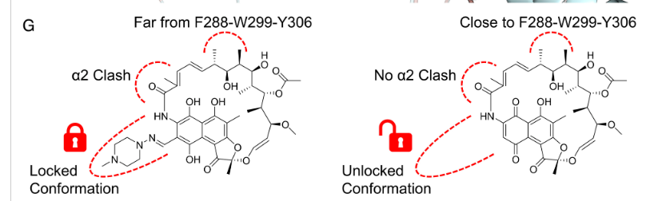

# DAY 1

- Chagned random split to scaffold split. Didnt seem to make much of a diff but kept anyway.
- LightGBM, Random forest and Gaussian process regression (too slow DNF) on the RDKIT descriptors. LightGBM was best marginally.
- LightGBM on RDKIT descriptors AND appended Morgan Fingerprints (now a larger, sparser feature space) - seemed to do marginally better?

- weighted training based on standard error (LightGBM): no difference, slight worsening.
- Next I took the top features of the lightgbm feature importance, found analogues (molecules with high TanimotoSimilarity) that had distinct PEC50s and looked at the feature diffs (of the top 10 features from lightGBM). The BertzCT was the main driver, and looking at the molecular structure, it seems that losely, larger, bulkier molecules are driving increased affinity to PxR..?

- Lipicity (polarity bad) seems to be important too, and there doesnt seem to be a hard MolWt cutoff.

- Structure paper: https://pmc.ncbi.nlm.nih.gov/articles/PMC2789303/

# DAY 2

- Let's look at analogues with high Tanimoto Similarity and their feature differentiators but using the RKDIT Descriptors representation rather than the Morgan Fingerprints. Let's seee how much the representation affects the feature diferentiation and molecular pairs:
    - The molecules seem less similar. The same features dominate but I wonder if that's because i didnt normalize.

- Paper on binding to PxR: https://www.pnas.org/doi/10.1073/pnas.2217804120: 

# Day 3

- Tried different feature combinations but in the end n-estimators=3000 worked best.
- Morgan FP, RDKit Descriptors and a few "PXR features" like n_aromatic_rings, max_ring_size, hybrophobit "bulk" vs polar "disruption", steric "center of gravity". None of these features proved important in the SHAP analysis.
- Most important featuress was PEOE_VSA4 + Chi4v. All RDKIT de4scriptor features.
- But Morgan Fingerprints still seemed to help RAE even though features weren't explicitly important.

# Day 4

- Create an ensembele between two separately trained models (split by pEC450 = 4.5) into a high pEC450 and low pEC450 model(s) (shouldnt thsi be emax? Ig it's the same thing...)

- Used a weighted smooth sigmoid ensemble weighting. for maximal RAE.
- But RAE on test set was pretty bad here ~0.714. Even though the training RAE for weighted ensembling was pretty low ~0.55.

# Day 5

- Tried training with deep model embeddings.
- Tried ChemBERTa, MolFormer embeddings, and a metalearner that tries to compute attention weights on stacked embeddings from ChemBerta, MolFormer, and RDKit descriptors.
- Uncertainty-weighted loss to lower impact of uncertain training data.
- scaffold based K-fold cross valdation
- RDKit was found to have by far the most attention weight/importance.

# Day 6

- ChemBerta and MolFormer embeddings, normalized and an ablation study on RDKit, Morgan Fingerprints, ChemBerta embeddings and MolFormer embeddings and every combo.
- Found that RDKit + Morgan + ChemBerta was marginally the best, followed by just RDKIt + Morgan.
- Trained TabNet on the top 3 embedding configurations
(  1. RDKit + Morgan
  2. RDKit + Morgan + ChemBERTa
  3. RDKit + Morgan + MoLFormer)
- Compared with LGBM and LGBM just did way better than TabNet.
- Submitted LGBM on RDKIT + Morgan + Molformer. Butt even though RAE was 0.62, test RAE was ~0.71, so pretty bad.

# Day 7

- Tried using a feature to delimit the molecules that passed the counter assay and the molecules that did not. Used the full 4000 molecules tested instead of just the 2800 passing. But then I had to assume the blind test had no false positives (would all pass the counter-assay) since we don't really know.
- Resulted in really bad performance (0.75 RAE)

# Day 8

- Tried using a naive GNN and an ensemble with the LGBM on RDKIT+MF.
- Did ok, RAE of 0.68

# Day 9
- Trying to use 3d Chemprop features...but found that RDKIT + Morgans was better than any Chemprop 3d features on training set! Didn't submit anything...